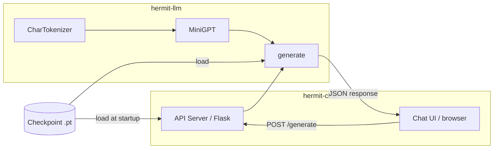

# Design Document: hermit-ai

## Overview

hermit-ai is an educational project split into two self-contained Python modules:

- **hermit-llm** — a GPT-style character-level language model built from scratch with PyTorch
- **hermit-chat** — a local web interface (Flask API server + static HTML/JS frontend) for interacting with the trained model

The guiding principle is *understanding over convenience*: every class is small, every method is commented to explain the math, and tests accompany each component so the learner can verify their understanding in isolation.

The model architecture follows the original GPT-2 design: token + position embeddings → N × TransformerBlock (pre-norm, causal self-attention + feed-forward) → linear language-modeling head. The tokenizer operates at the character level, keeping the vocabulary tiny and the implementation transparent.

---

## Architecture

### hermit-llm

```
hermit-llm/
├── tokenizer.py          # CharTokenizer
├── attention.py          # CausalSelfAttention
├── feedforward.py        # FeedForward
├── block.py              # TransformerBlock
├── model.py              # MiniGPT
├── train.py              # Training loop
├── generate.py           # Standalone generation script
├── requirements.txt
└── tests/
    ├── test_tokenizer.py
    ├── test_attention.py
    ├── test_feedforward.py
    ├── test_block.py
    ├── test_model.py
    └── test_train.py
```

### hermit-chat

```
hermit-chat/
├── server.py             # Flask API server
├── static/
│   ├── index.html
│   ├── style.css
│   └── app.js
└── requirements.txt
```

### Data flow



---

## Components and Interfaces

### CharTokenizer (`tokenizer.py`)

Builds a character-level vocabulary from a training corpus and provides encode/decode.

```python
class CharTokenizer:
    def __init__(self, text: str) -> None: ...
    @property
    def vocab_size(self) -> int: ...
    def encode(self, text: str) -> list[int]: ...
    def decode(self, ids: list[int]) -> str: ...
    # pickle-compatible: __getstate__ / __setstate__ not needed;
    # the instance is directly picklable because it only holds dicts and ints
```

Key internals:
- `self._char_to_id: dict[str, int]` — maps each unique character to an integer index
- `self._id_to_char: dict[int, str]` — reverse mapping for decoding
- `encode` raises `KeyError` for unknown characters
- `decode` is the inverse of `encode`

### CausalSelfAttention (`attention.py`)

Multi-head scaled dot-product attention with a causal (lower-triangular) mask.

```python
class CausalSelfAttention(nn.Module):
    def __init__(self, embed_dim: int, num_heads: int, dropout: float) -> None: ...
    def forward(self, x: Tensor) -> Tensor: ...  # (B, T, C) -> (B, T, C)
```

Key internals:
- Single `nn.Linear(embed_dim, 3 * embed_dim)` projects Q, K, V in one shot
- Output projection: `nn.Linear(embed_dim, embed_dim)`
- Causal mask registered as a buffer: `torch.tril(torch.ones(T, T))`
- Attention scores: `(Q @ K.T) / sqrt(head_dim)`, masked, softmaxed, dropout applied
- Heads split/merged via `view` + `transpose`

### FeedForward (`feedforward.py`)

Position-wise two-layer MLP with GELU activation.

```python
class FeedForward(nn.Module):
    def __init__(self, embed_dim: int, dropout: float) -> None: ...
    def forward(self, x: Tensor) -> Tensor:  # (B, T, C) -> (B, T, C)
```

Key internals:
- `Linear(embed_dim, 4 * embed_dim)` → GELU → `Linear(4 * embed_dim, embed_dim)` → Dropout

### TransformerBlock (`block.py`)

Pre-norm transformer layer: LayerNorm → Attention (residual) → LayerNorm → FFN (residual).

```python
class TransformerBlock(nn.Module):
    def __init__(self, embed_dim: int, num_heads: int, dropout: float) -> None: ...
    def forward(self, x: Tensor) -> Tensor:  # (B, T, C) -> (B, T, C)
```

### MiniGPT (`model.py`)

Top-level model: embeddings → N blocks → LayerNorm → LM head.

```python
class MiniGPT(nn.Module):
    def __init__(
        self,
        vocab_size: int,
        embed_dim: int,
        num_heads: int,
        num_layers: int,
        context_length: int,
        dropout: float,
    ) -> None: ...

    def forward(
        self,
        idx: Tensor,                  # (B, T)
        targets: Tensor | None = None # (B, T)
    ) -> tuple[Tensor, Tensor | None]: ...  # logits (B,T,V), loss or None

    def generate(
        self,
        idx: Tensor,          # (1, T) seed tokens
        max_new_tokens: int,
        temperature: float = 1.0,
    ) -> Tensor: ...          # (1, T + max_new_tokens)
```

### Training Loop (`train.py`)

Standalone script (also importable for testing). Configurable via a `HyperParams` dataclass.

```python
@dataclass
class HyperParams:
    data_path: str = "data/input.txt"
    batch_size: int = 32
    context_length: int = 128
    embed_dim: int = 128
    num_heads: int = 4
    num_layers: int = 4
    dropout: float = 0.1
    max_steps: int = 5000
    eval_interval: int = 500
    learning_rate: float = 3e-4
    checkpoint_path: str = "checkpoint.pt"

def get_batch(data: Tensor, batch_size: int, context_length: int, device: str) -> tuple[Tensor, Tensor]: ...
def train(hp: HyperParams) -> None: ...
```

Checkpoint format (saved with `torch.save`):

```python
{
    "model_state_dict": model.state_dict(),
    "tokenizer": tokenizer,          # pickled CharTokenizer
    "config": dataclasses.asdict(hp),
}
```

### Generation Script (`generate.py`)

```python
def load_checkpoint(path: str) -> tuple[MiniGPT, CharTokenizer, dict]: ...
def generate_text(
    prompt: str,
    checkpoint_path: str,
    max_new_tokens: int = 200,
    temperature: float = 1.0,
) -> str: ...
```

### API Server (`server.py`)

Flask application. Loads checkpoint once at startup, exposes `/generate`.

```python
POST /generate
Content-Type: application/json

Request:  { "prompt": str, "max_new_tokens"?: int, "temperature"?: float }
Response: { "response": str }
Errors:   400 { "error": "prompt is required" }
          500 { "error": "<message>" }
```

CORS is enabled for `http://localhost:*` via the `flask-cors` package.

### Chat UI (`static/`)

Plain HTML + vanilla JS, no build step. `app.js` uses `fetch()` to call the API server. `index.html` includes `style.css` and `app.js` via `<script>` / `<link>` tags.

---

## Data Models

### Tensor shapes (hermit-llm)

| Symbol | Meaning |
|--------|---------|
| B | batch size |
| T | sequence length (≤ context_length) |
| C | embed_dim |
| V | vocab_size |
| H | num_heads |
| D | head_dim = C / H |

Key tensor shapes at each stage:

```
Input idx:          (B, T)          — integer token IDs
Token embeddings:   (B, T, C)
Position embeddings:(B, T, C)
After sum:          (B, T, C)
Q, K, V (per head): (B, H, T, D)
Attention weights:  (B, H, T, T)
After attention:    (B, T, C)
After FFN:          (B, T, C)
Logits:             (B, T, V)
Loss:               scalar
```

### Checkpoint file

Saved as a Python dict via `torch.save` (uses pickle internally):

```python
{
    "model_state_dict": OrderedDict,   # PyTorch state dict
    "tokenizer": CharTokenizer,        # pickled instance
    "config": {                        # hyperparameter dict
        "vocab_size": int,
        "embed_dim": int,
        "num_heads": int,
        "num_layers": int,
        "context_length": int,
        "dropout": float,
    }
}
```

### API request / response

```typescript
// POST /generate
interface GenerateRequest {
    prompt: string;
    max_new_tokens?: number;   // default: 200
    temperature?: number;      // default: 1.0
}

interface GenerateResponse {
    response: string;
}

interface ErrorResponse {
    error: string;
}
```

---

## Correctness Properties

*A property is a characteristic or behavior that should hold true across all valid executions of a system — essentially, a formal statement about what the system should do. Properties serve as the bridge between human-readable specifications and machine-verifiable correctness guarantees.*

The feature is well-suited for property-based testing: the core components are pure functions (or near-pure modules) with clear input/output contracts, large input spaces (arbitrary strings, tensor shapes, hyperparameter combinations), and universal invariants that should hold for all valid inputs. The recommended PBT library is [Hypothesis](https://hypothesis.readthedocs.io/) for Python.

---

### Property 1: Vocabulary size equals unique character count

*For any* non-empty string, constructing a `CharTokenizer` from it SHALL produce a `vocab_size` equal to the number of distinct characters in that string.

**Validates: Requirements 1.1, 1.2**

---

### Property 2: Encode–decode round trip

*For any* string composed entirely of characters in the tokenizer's vocabulary, calling `decode(encode(text))` SHALL return the original string unchanged.

**Validates: Requirements 1.3, 1.4, 1.6**

---

### Property 3: Encode raises KeyError for unknown characters

*For any* `CharTokenizer` and any string containing at least one character not present in its vocabulary, calling `encode` SHALL raise a `KeyError`.

**Validates: Requirements 1.5**

---

### Property 4: Tokenizer pickle round trip

*For any* `CharTokenizer` instance, pickling and unpickling it SHALL produce an instance with the same `vocab_size` and identical `encode`/`decode` behavior on all vocabulary strings.

**Validates: Requirements 1.7**

---

### Property 5: CausalSelfAttention rejects invalid head configuration

*For any* `(embed_dim, num_heads)` pair where `embed_dim % num_heads != 0`, constructing a `CausalSelfAttention` SHALL raise an `AssertionError`.

**Validates: Requirements 2.2**

---

### Property 6: Shape preservation through attention, FFN, and transformer block

*For any* valid `(B, T, embed_dim)` input tensor:
- `CausalSelfAttention.forward(x)` SHALL return a tensor of shape `(B, T, embed_dim)`
- `FeedForward.forward(x)` SHALL return a tensor of shape `(B, T, embed_dim)`
- `TransformerBlock.forward(x)` SHALL return a tensor of shape `(B, T, embed_dim)`

**Validates: Requirements 2.3, 3.2, 4.2**

---

### Property 7: Causal masking — future tokens do not influence past outputs

*For any* input sequence, modifying token values at positions `j > i` SHALL NOT change the output of `CausalSelfAttention` at position `i`.

**Validates: Requirements 2.4**

---

### Property 8: Dropout stochasticity in training mode vs. determinism in eval mode

*For any* input tensor, two forward passes through `CausalSelfAttention` in training mode SHALL (with high probability) produce different outputs, while two forward passes in eval mode SHALL produce identical outputs.

**Validates: Requirements 2.6**

---

### Property 9: MiniGPT logits shape

*For any* valid `(B, T)` integer token tensor where `T ≤ context_length`, `MiniGPT.forward(idx)` SHALL return logits of shape `(B, T, vocab_size)`.

**Validates: Requirements 5.4**

---

### Property 10: MiniGPT loss is a finite positive scalar

*For any* valid `(idx, targets)` pair of integer token tensors, `MiniGPT.forward(idx, targets)` SHALL return a finite positive scalar loss value.

**Validates: Requirements 5.5**

---

### Property 11: MiniGPT raises AssertionError when sequence exceeds context length

*For any* input tensor with sequence length `T > context_length`, `MiniGPT.forward` SHALL raise an `AssertionError`.

**Validates: Requirements 5.6**

---

### Property 12: Weight initialization statistics

*For any* valid set of MiniGPT hyperparameters, all `Linear` and `Embedding` weight tensors SHALL have mean close to `0.0` and standard deviation close to `0.02` immediately after construction.

**Validates: Requirements 5.7**

---

### Property 13: Generate output length (including truncation robustness)

*For any* seed token sequence of length `T` and any `max_new_tokens ≥ 1` (including values larger than `context_length`), `MiniGPT.generate` SHALL return a sequence of length exactly `T + max_new_tokens` without raising an error.

**Validates: Requirements 5.9, 5.10**

---

### Property 14: Training data split sizes

*For any* encoded dataset of length `N`, the training split SHALL have length `floor(0.9 * N)` and the validation split SHALL have length `N - floor(0.9 * N)`.

**Validates: Requirements 6.3**

---

### Property 15: Batch shape and target offset

*For any* valid `(batch_size, context_length)` configuration, `get_batch` SHALL return tensors `x` and `y` both of shape `(batch_size, context_length)`, where `y[i, t] == x[i, t+1]` for all valid `i` and `t < context_length - 1`.

**Validates: Requirements 6.4**

---

### Property 16: Checkpoint round trip

*For any* trained `MiniGPT` and `CharTokenizer`, saving a checkpoint and loading it SHALL reconstruct a model with identical weights and a tokenizer with identical `encode`/`decode` behavior.

**Validates: Requirements 6.7, 7.1**

---

## Error Handling

### hermit-llm

| Situation | Behavior |
|-----------|----------|
| `CharTokenizer.encode` receives unknown character | Raise `KeyError("Unknown character: '<char>'")`  |
| `CausalSelfAttention` constructed with `embed_dim % num_heads != 0` | Raise `AssertionError` at `__init__` time |
| `MiniGPT.forward` called with `T > context_length` | Raise `AssertionError("Sequence length exceeds context_length")` |
| Training data file not found | Fall back to built-in sample text; log a warning to stderr |
| Checkpoint file not found (generation script) | Print descriptive error to stderr; `sys.exit(1)` |

### hermit-chat

| Situation | Behavior |
|-----------|----------|
| `POST /generate` missing `prompt` field | Return HTTP 400 `{"error": "prompt is required"}` |
| Checkpoint not found at server startup | Log error to stderr; `sys.exit(1)` |
| Model raises exception during generation | Return HTTP 500 `{"error": "<exception message>"}` |
| Chat UI receives non-2xx response | Display error message in conversation history; do not crash |

---

## Testing Strategy

### Dual testing approach

Both unit/example tests and property-based tests are used. Unit tests cover specific examples, edge cases, and integration points. Property tests verify universal invariants across many generated inputs.

### Property-based testing

**Library**: [Hypothesis](https://hypothesis.readthedocs.io/) (`pip install hypothesis`)

**Configuration**: Each property test runs a minimum of 100 examples (`@settings(max_examples=100)`).

**Tag format** (comment above each test):
```python
# Feature: hermit-ai, Property <N>: <property_text>
```

Each correctness property above maps to exactly one `@given`-decorated test function.

### Unit tests (example-based)

Focused on:
- Construction with valid and invalid parameters
- Specific tensor shapes and values
- Error conditions (KeyError, AssertionError, SystemExit)
- Checkpoint save/load integration
- API server endpoints (Flask test client)
- Gradient clipping verification

### Test file mapping

| Test file | Components covered | Properties covered |
|-----------|-------------------|-------------------|
| `tests/test_tokenizer.py` | CharTokenizer | 1, 2, 3, 4 |
| `tests/test_attention.py` | CausalSelfAttention | 5, 6 (attention), 7, 8 |
| `tests/test_feedforward.py` | FeedForward | 6 (FFN) |
| `tests/test_block.py` | TransformerBlock | 6 (block) |
| `tests/test_model.py` | MiniGPT | 9, 10, 11, 12, 13 |
| `tests/test_train.py` | Training loop, checkpoint | 14, 15, 16 |

### Avoiding over-testing

Unit tests focus on concrete examples and error conditions. Property tests handle broad input coverage. There is no need to write separate unit tests for every input variation that property tests already cover.

### hermit-chat testing

The API server is tested with Flask's built-in test client. The frontend JS is tested manually (no build step means no Jest setup is required, though simple DOM tests with jsdom are optional).

### Running the test suite

```bash
# hermit-llm
cd hermit-llm
pip install -r requirements.txt
pytest tests/ -v

# hermit-chat (API tests only)
cd hermit-chat
pip install -r requirements.txt
pytest tests/ -v
```
